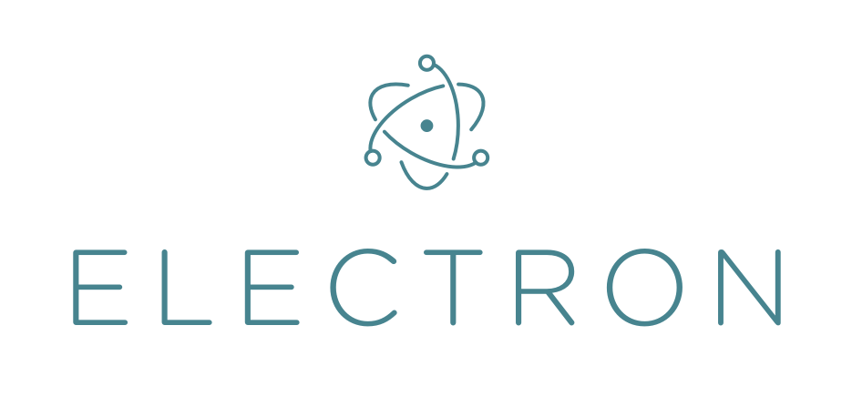

# 🖥️ Sandbox

<h1 align="center">
  
</h1>

## 🔎️ Description
A sandbox application to try Electron features.

This project was made during the <a href="https://www.udemy.com/course/master-electron/">Master Electron v5: Desktop Apps with HTML, JavaScript & CSS</a> course on Udemy.

## 🚀️ Technologies

- HTML
- CSS
- JavaScript
- Electron
 
---

Thank you and good coding 😎️

Made by **<a href="https://paulophlp.github.io/portfolio/" target="__blank">Paulo Lima 🤓️</a>**